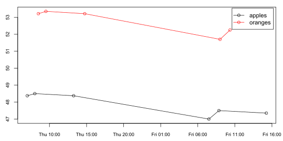

<!-- README.md is generated from README.Rmd. Please edit that file -->
### Introduction

This package provides S3 classes ("uts\_vector" and "uts\_matrix") for multivariate unevenly spaced time series. The individual time series are [uts](https://github.com/andreas50/uts) objects.

R users familiar with vectors and matrices should find it straightforward to work with the corresponding time series objects, because the usage of many functions (such as \[, \[\[, length, etc.) is completely analogous.

### Installation

This package is not yet available on CRAN, but can be installled from GitHub, either using the `R` package [devtools](https://cran.r-project.org/web/packages/devtools/index.html):

``` r
devtools::install_github("andreas50/uts", build_vignettes=TRUE)
devtools::install_github("andreas50/utsMultivariate")
```

or using the `R` package [remotes](https://cran.r-project.org/web/packages/remotes/index.html):

``` r
remotes::install_github("andreas50/uts")
remotes::install_github("andreas50/utsMultivariate")
```

### Sample Code

First, a few examples how to use a time series vector.

``` r
# Get sample unevenly-spaced time series vector
x <- ex_uts_vector()
x
#>      Name Datapoints                   start                     end
#> 1  apples          6 2007-11-08 07:00:00 EST 2007-11-09 15:15:00 EST
#> 2 oranges          5 2007-11-08 08:30:00 EST 2007-11-09 10:21:00 EST
```

``` r
# Plot the time series vector
plot(x, type="o", cex.axis=0.8)
```



``` r
# Get first and last observation value(!) of each time series
first(x)
#>  apples oranges 
#> 48.3750 53.2125
last(x)
#>  apples oranges 
#>   47.35   52.25

# Get first and last observation time(!) of each time series
start(x)
#>                    apples                   oranges 
#> "2007-11-08 07:00:00 EST" "2007-11-08 08:30:00 EST"
end(x)
#>                    apples                   oranges 
#> "2007-11-09 15:15:00 EST" "2007-11-09 10:21:00 EST"

# Insert new observation
x[as.POSIXct("2007-11-10 10:00:00"), "apples"] <- 45

# Sample the time series at a specific time point, using one of several supported interpolation methods
sample_values(x, as.POSIXct("2007-11-10"), interpolation="linear")
#>   apples  oranges 
#> 46.25333 52.25000

# Get maximum observation value of each time series
max(x)
#>  apples oranges 
#>   48.50   53.35

# Time series arithmetic
(x*2 + 5)$apples$values
#> [1] 101.75 102.00 101.75  99.00 100.00  99.70  95.00

# Apply a function to the individual time series of a time series vector
sapply(x, length)
#>  apples oranges 
#>       7       5
sapply(x, range)
#>      apples oranges
#> [1,]   45.0   51.70
#> [2,]   48.5   53.35

# Convert the time series vector to data.frame, i.e. flatten the data
as.data.frame(x)
#>                   time apples oranges
#> 1  2007-11-08 07:00:00 48.375      NA
#> 2  2007-11-08 08:01:00 48.500      NA
#> 3  2007-11-08 08:30:00     NA 53.2125
#> 4  2007-11-08 09:31:00     NA 53.3500
#> 5  2007-11-08 13:15:00 48.375      NA
#> 6  2007-11-08 14:45:00     NA 53.2125
#> 7  2007-11-09 07:30:00 47.000      NA
#> 8  2007-11-09 08:51:00 47.500      NA
#> 9  2007-11-09 09:00:00     NA 51.7000
#> 10 2007-11-09 10:21:00     NA 52.2500
#> 11 2007-11-09 15:15:00 47.350      NA
#> 12 2007-11-10 10:00:00 45.000      NA

# Conversely, convert data in flat (long) format to a time series vector
values <- data.frame(apples=1:10, oranges=letters[1:10], stringsAsFactors=FALSE)
uts_vector_wide(values, times=as.POSIXct("2015-01-01") + ddays(1:10))
#>      Name Datapoints          start            end
#> 1  apples         10 2015-01-02 EST 2015-01-11 EST
#> 2 oranges         10 2015-01-02 EST 2015-01-11 EST

# Convert data in wide format to a time series vector
values <- c(5, 6, 6, 7)
times <- as.POSIXct("2016-01-01") + dhours(1:4)
names <- c("a", "b", "a", "a")
uts_vector_long(values, times, names)
#>   Name Datapoints                   start                     end
#> 1    a          3 2016-01-01 01:00:00 EST 2016-01-01 04:00:00 EST
#> 2    b          1 2016-01-01 02:00:00 EST 2016-01-01 02:00:00 EST
```

Most operatios for time series vectors also apply to a time series matrix, so only a few examples are given here.

``` r
# Create a time series matrix by recycling the elements of a time series vector
y <- uts_matrix(x, nrow=2, ncol=3)
rownames(y) <- c("foo", "bar")
colnames(y) <- c("red", "green", "blue")
y
#>     red    green  blue  
#> foo uts[7] uts[7] uts[7]
#> bar uts[5] uts[5] uts[5]

# Extract first two rows, and second column (coming soon)
#y[, 1:2, "green"]

# Transpose
t(y)
#>       foo    bar   
#> red   uts[7] uts[5]
#> green uts[7] uts[5]
#> blue  uts[7] uts[5]
```
